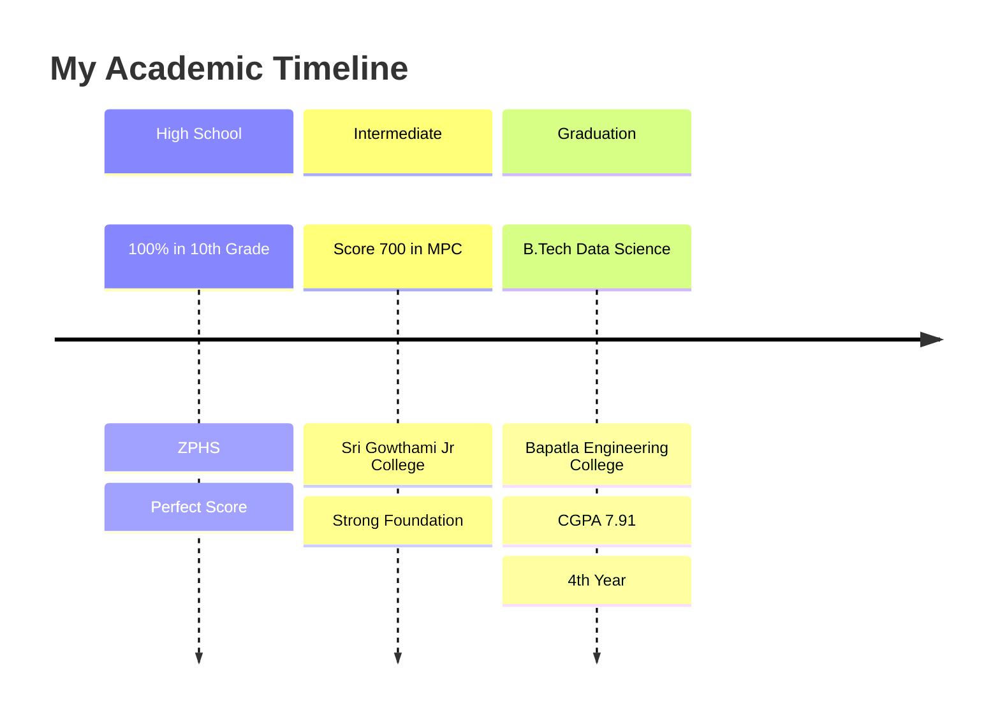

# Sri Venkata Satyanarayana Gattu - Portfolio Website

<div align="center">

<!-- Add your profile image here -->


### 🎯 Data Science Student | 🤖 ML Enthusiast | 💻 Web Developer

<p align="center">
  
  
  
</p>

### 🚀 [**VIEW LIVE PORTFOLIO**](your-portfolio-url-here) 🚀

</div>

---

## 📊 Quick Stats

<div align="center">

| 🎓 Education | 📈 CGPA | 🏆 Certificates | 💼 Projects |
|:---:|:---:|:---:|:---:|
| B.Tech Data Science | 7.91 | 14+ | 2+ |

</div>

---

## 🙋‍♂️ About Me


```python
class DataScientist:
    def __init__(self):
        self.name = "Sri Venkata Satyanarayana Gattu"
        self.role = "Data Science Student"
        self.location = "India"
        self.education = "B.Tech Data Science (4th Year)"
        self.cgpa = 7.91
        
    def get_skills(self):
        return {
            "languages": ["Python"],
            "data_science": ["Machine Learning", "Data Analysis"],
            "databases": ["MongoDB", "SQL"],
            "web_dev": ["HTML", "CSS", "JavaScript"],
            "tools": ["Git", "GitHub", "Power BI"]
        }
    
    def current_focus(self):
        return "Transforming data into actionable insights"
```

I'm passionate about solving complex problems through data and building practical solutions that make a difference.

---

## 🎓 Academic Journey

<div align="center">



</div>

| 🎯 Level | 🏫 Institution | 📊 Score | 🗓️ Status |
|:---:|:---|:---:|:---:|
| **B.Tech Data Science** | Bapatla Engineering College | **7.91 CGPA** | 🎓 4th Year |
| **Intermediate (MPC)** | Sri Gowthami Jr College | **700** | ✅ Completed |
| **10th Grade** | Zilla Parishad High School | **100%** | ✅ Completed |

---

## 🛠️ Technical Arsenal

<div align="center">

### Programming & Data Science
<p>
  
  
  
</p>

### Databases & Tools
<p>
  
  
  
</p>

### Web Development
<p>
  
  
  
</p>

### Version Control
<p>
  
  
</p>

</div>

---

## 🚀 Featured Projects

<div align="center">

### 🎯 Student Performance Prediction & Power BI Dashboard

   

**🔗 [View Code](https://github.com/SatyanarayanaG2908/Student-Performance-Prediction-)**

</div>

> **Objective**: Predict student performance using ML models and visualize insights with Power BI
> 
> **Key Features**:
> - 📊 Analyzes attendance, study hours, assignments impact on scores
> - 🧠 Considers lifestyle factors (stress, sleep patterns)
> - 🎯 Helps educators identify at-risk students
> - 📈 Interactive Power BI dashboard for insights

---

<div align="center">

### 🎯 Student Performance Factors Analysis

  

**🔗 [View Code](https://github.com/SatyanarayanaG2908/Student-Performance-Factors)**

</div>

> **Objective**: Identify critical factors affecting student performance
> 
> **Key Insights**:
> - 📚 Study habits are the most critical factor
> - 📊 Previous scores strongly predict future performance
> - 🎯 Provides targeted support recommendations
> - 🔍 Statistical analysis of performance patterns

---

## 🏆 Certifications & Achievements

<div align="center">

### 🌟 Industry Certifications

<table>
<tr>
<td align="center" width="33%">

**🔥 Tata/Forage**
<br>GenAI Powered Data Analytics
<br>

</td>
<td align="center" width="33%">

**🔵 IBM**
<br>Data Science Methodologies
<br>

</td>
<td align="center" width="33%">

**🌐 Cisco**
<br>Data Science & Python
<br>

</td>
</tr>
</table>

### 💼 Professional Experience

<table>
<tr>
<td align="center" width="50%">

**📈 Skill Dzire**
<br>Data Science Internship
<br>

</td>
<td align="center" width="50%">

**⚡ Vault of Codes**
<br>Technical Internship
<br>

</td>
</tr>
</table>

### 🎪 Events & Workshops

<table>
<tr>
<td align="center" width="50%">

**🏆 IITH Hackathon**
<br>Team Collaboration & Problem Solving
<br>

</td>
<td align="center" width="50%">

**🔧 IITH Workshop**
<br>Practical Implementation Experience
<br>

</td>
</tr>
</table>

</div>

**📜 Total Certifications: 14+** | **All certificates viewable in portfolio**

---

## 🤝 Connect With Me

<div align="center">

### 🔗 Professional Networks

<p>
  <a href="https://github.com/SatyanarayanaG2908">
    
  </a>
  <a href="https://www.linkedin.com/in/satyanarayanagattu">
    
  </a>
  <a href="mailto:satyanarayanagattu523@gmail.com">
    
  </a>
  <a href="tel:+916304097103">
    
  </a>
</p>

### 📱 Quick Contact
```
📧 Email: satyanarayanagattu523@gmail.com
📞 Phone: +91 63040 97103
🔗 LinkedIn: /in/satyanarayanagattu
👨‍💻 GitHub: /SatyanarayanaG2908
```

</div>

---

## 🌟 Portfolio Features

<div align="center">

| Feature | Description | Status |
|:---:|:---:|:---:|
| 📱 **Responsive Design** | Works on all devices | ✅ Active |
| 🎨 **Modern UI/UX** | Clean animations & effects | ✅ Active |
| 📧 **Contact Form** | Direct EmailJS integration | ✅ Working |
| 🏆 **Certificate Gallery** | Interactive viewing | ✅ Active |
| 🚀 **Project Showcase** | GitHub integration | ✅ Working |
| ⚡ **Fast Loading** | Optimized performance | ✅ Active |

</div>

---

## 🎯 Currently Seeking

<div align="center">

<table>
<tr>
<td align="center" width="25%">

**💼 Full-time Roles**
<br>Data Science Positions
<br>

</td>
<td align="center" width="25%">

**🚀 Internships**
<br>ML & Data Projects
<br>

</td>
<td align="center" width="25%">

**💻 Freelance**
<br>Data Analysis Projects
<br>

</td>
<td align="center" width="25%">

**🤝 Collaboration**
<br>Open Source Projects
<br>

</td>
</tr>
</table>

</div>

---

## 📄 Resume

<div align="center">

**📋 [Download My Resume]**[Gattu Resume.pdf](https://github.com/user-attachments/files/22281740/Gattu.Resume.pdf)


</div>

---

<div align="center">

### 🚀 Ready to collaborate? Let's build something amazing together! 🚀

 <em><b>Available for opportunities!</b> Let's discuss how we can work together.</em> 

---

**Built with ❤️ and lots of ☕**


</div>
